

# PA4 Submission: TaskFlow Pipeline

This document serves as the formal technical submission for Programming Assignment 4. All supporting evidence is maintained within the <code>docs/</code> directory and referenced via relative paths.

## Student Information

| Field | Value |
|---|---|
| Name | Syed Muhammad Murtaza Hassan |
| Roll Number | 27100214 |
| GitHub Repository URL | https://github.com/Murtaza214-cyber/CS487-PA4-27100214 |
| Resource Group | `rg-sp26-27100214` |
| Assigned Region | `ukwest` |

## Evidence Rules

- Relative image paths are implemented: ``.
- Descriptions provide technical verification for each architectural component.
- Security protocols were followed; sensitive connection strings and keys have been masked.

---

## Task 1: App Service Web App (15 points)

### Evidence 1.1: Forked Repository

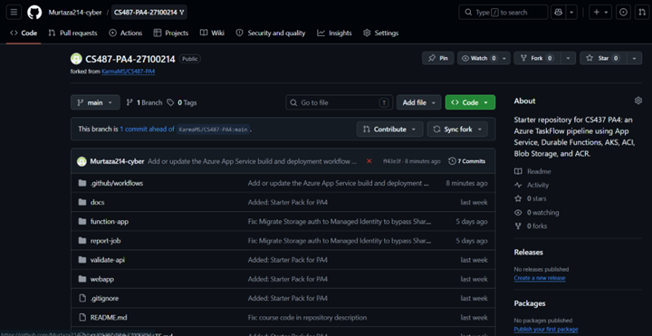

Description: The screenshot verifies the successful creation of the project fork under the GitHub account "Murtaza214-cyber," serving as the foundational source control for the pipeline.

### Evidence 1.2: App Service Overview

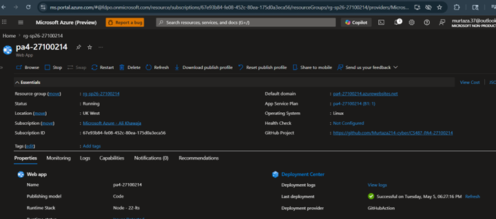

Description: The Azure Portal overview confirms that the Web App `pa4-27100214` is in a "Running" state within the designated `ukwest` region and `rg-sp26-27100214` resource group.

### Evidence 1.3: Deployment Center / GitHub Actions

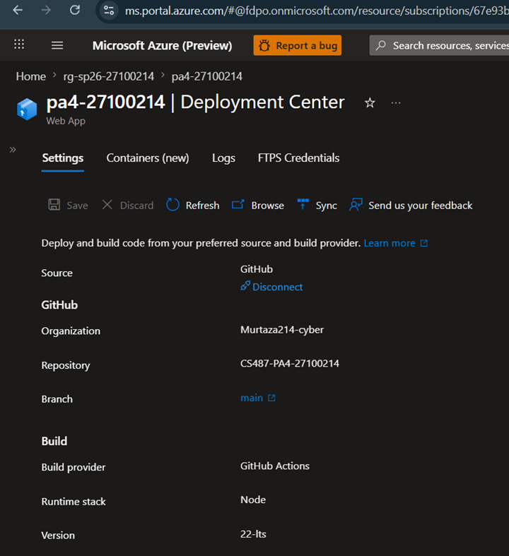

Description: This evidence demonstrates the successful integration between GitHub Actions and the Azure App Service Deployment Center, ensuring automated builds from the `main` branch.

### Evidence 1.4: Live Web UI

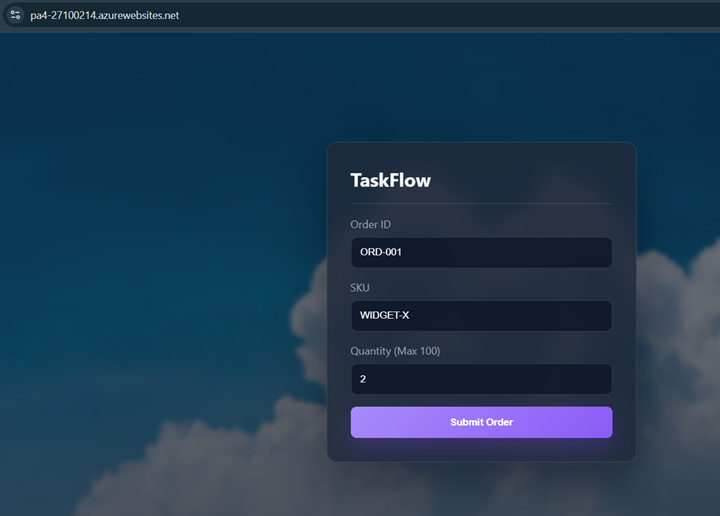

Description: The dashboard interface is shown loaded in a web browser, confirming that the App Service is successfully hosting the frontend React application.

---

## Task 2: Azure Container Registry (15 points)

### Evidence 2.1: ACR Overview

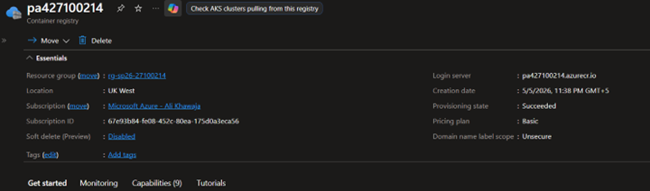

Description: The container registry `pa427100214` is verified as provisioned on the Basic SKU with a healthy provisioning state.

### Evidence 2.2: Docker Builds

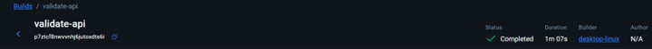
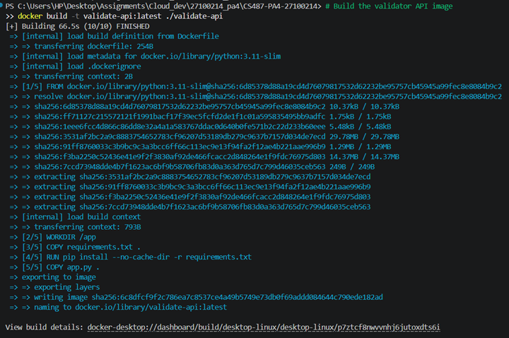
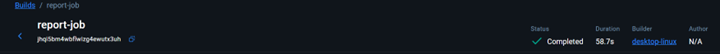
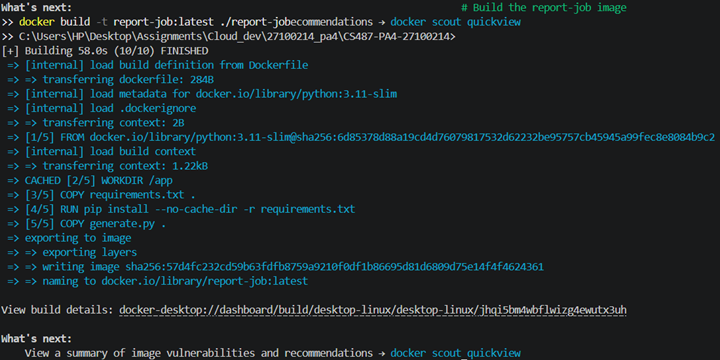
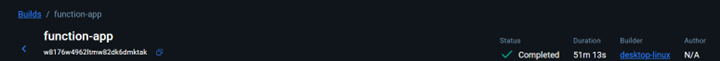
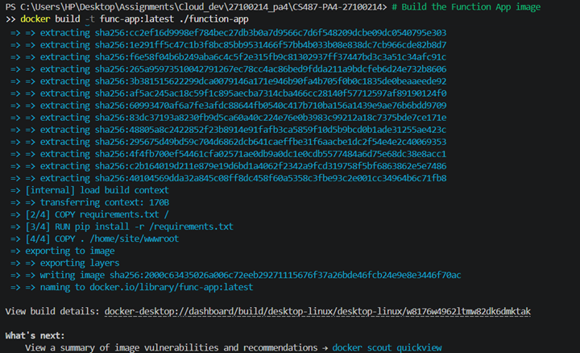
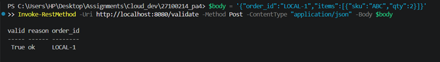

Description: These logs and status indicators provide evidence of the successful local compilation and testing of the three Docker images: `validate-api`, `report-job`, and `func-app`.

### Evidence 2.3: ACR Repositories

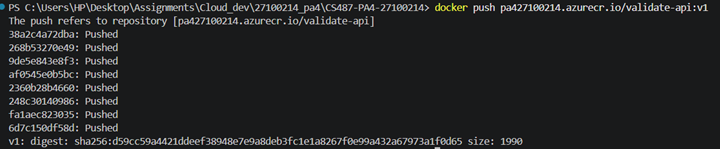
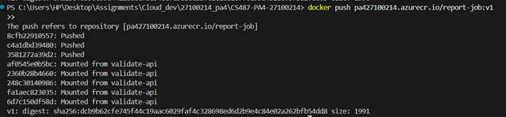
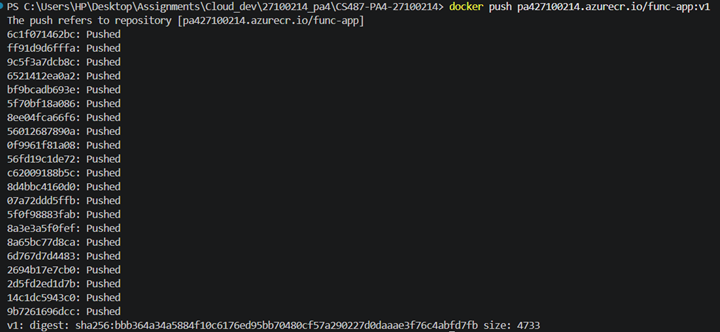
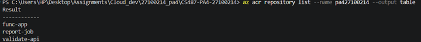

Description: The CLI output confirms the successful push of all three container images to the registry, with the repository list displaying all required services.

---

## Task 3: Durable Function Implementation (12 points)

### Evidence 3.2: Local Function Handler Listing

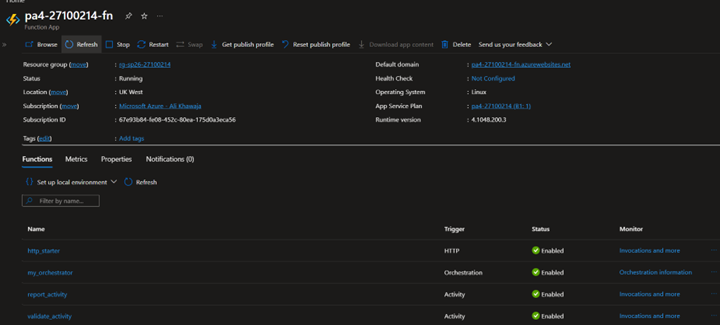

Description: The Azure Portal displays the discovered function triggers, confirming the presence of the `http_starter`, `my_orchestrator`, and both activity handlers.

---

## Task 4: Function App Container Deployment (8 points)

### Evidence 4.1: Function App Container Configuration

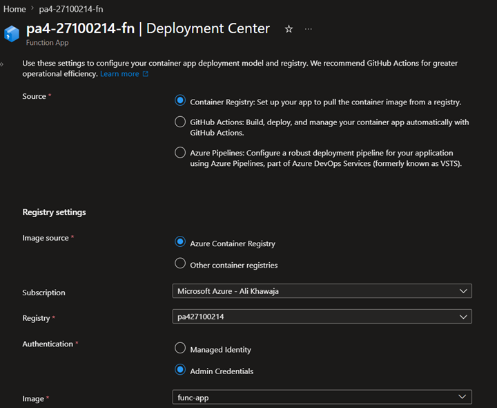
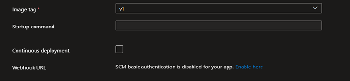

Description: The Deployment Center settings confirm the Function App is configured to pull the authenticated `func-app:v1` image from the `pa427100214` registry.

Description: Screenshot of the Functions list in the Portal showing http_starter, my_orchestrator, validate_activity, report_activity

### Evidence 4.2: Orchestration Smoke Test

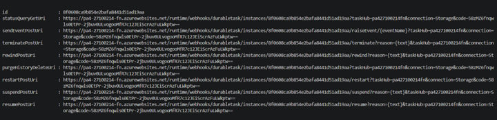

Description: A manual `curl` request successfully triggers the orchestrator, returning the unique instance ID and the status query URI for tracking.

### Evidence 4.3: Expected Failed Status Before Downstream Wiring

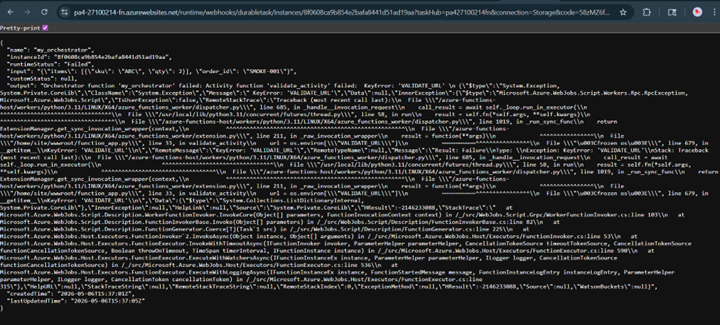

Description: The status JSON confirms an orchestration failure due to the expected absence of the `VALIDATE_URL` environment variable at this stage of deployment.

---

## Task 5: AKS Validator (15 points)

### Evidence 5.1: AKS Cluster

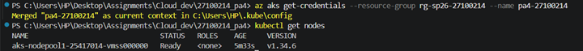

Description: The `kubectl get nodes` command confirms the AKS node pool is operational and the cluster context has been correctly merged into the local configuration.

### Evidence 5.2: Kubernetes Nodes and Pods

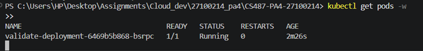

Description: The evidence shows the `validate-deployment` pod in a "Running" state, confirming that the container was successfully pulled and scheduled.

### Evidence 5.3: Kubernetes Service

Description: The `validate-service` is formally exposed via a LoadBalancer, providing a persistent External-IP for the Durable Function activity.

### Evidence 5.4: Validator API Tests

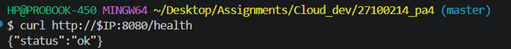
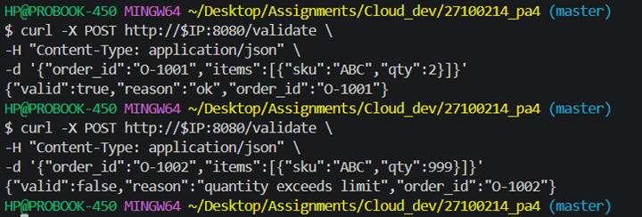

Description: The API demonstrates correct behavior by approving valid quantities and rejecting orders that exceed the defined threshold of 100 units.

### Evidence 5.5: Function App `VALIDATE_URL`

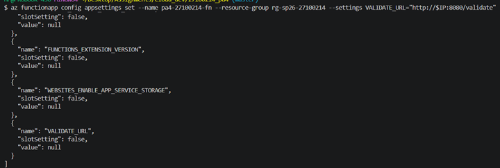
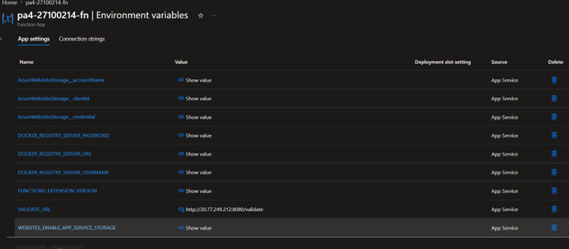

Description: The environment variable `VALIDATE_URL` has been successfully applied to the Function App, enabling connectivity to the AKS LoadBalancer.

---

## Task 6: ACI Report Job (15 points)

### Evidence 6.1: Blob Container

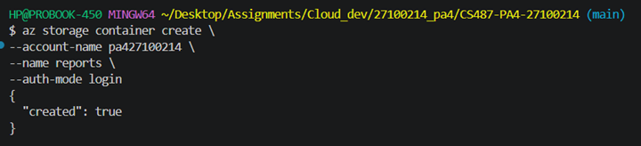

Description: The Azure CLI output confirms the successful creation of the `reports` container within the storage account.

### Evidence 6.2: Manual ACI Run

Description: The `ci-report-test` instance reached a "Succeeded" state, verifying that the `report-job` image can execute successfully in a serverless environment.

### Evidence 6.3: ACI Logs

### Evidence 6.4: Generated PDF

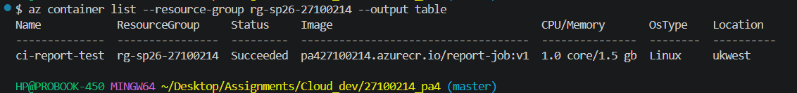

Description:

### Evidence 6.5: Function App Managed Identity and IAM

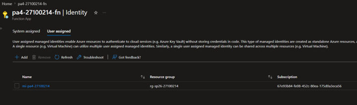

Description: The evidence displays the User Assigned Managed Identity associated with the Function App to facilitate secure resource management.

### Evidence 6.6: Report App Settings

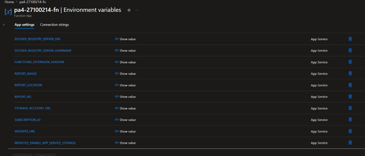

Description: The configuration demonstrates that all required reporting and identity variables have been formally applied to the Function App.

---

## Task 7: End-to-End Pipeline (15 points)

### Evidence 7.1: Happy Path UI

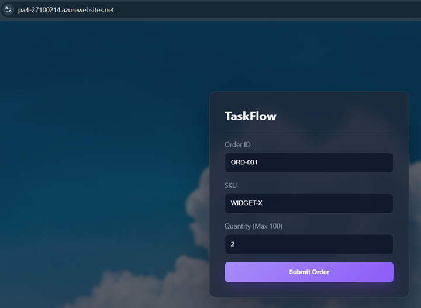
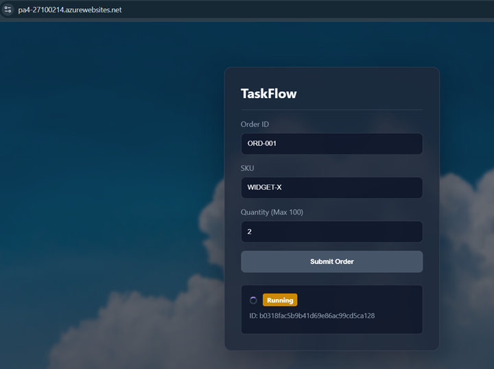
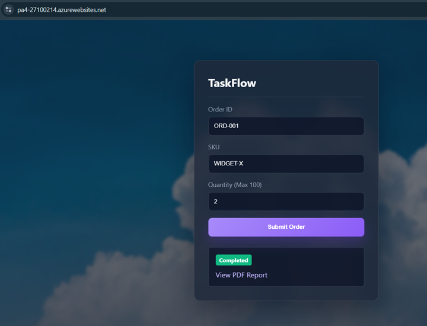
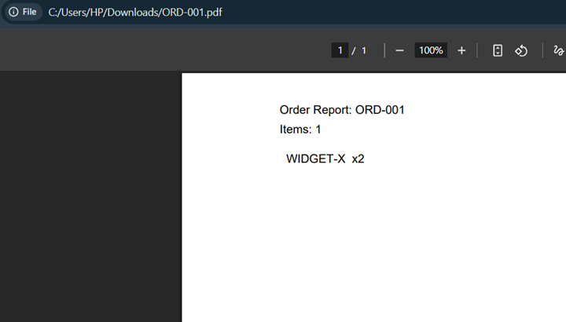

Description: The dashboard demonstrates a complete orchestration cycle, successfully processing a valid order and providing a functional PDF report link.

### Evidence 7.3: Backend Participation

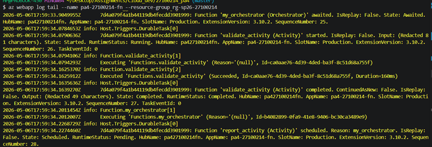
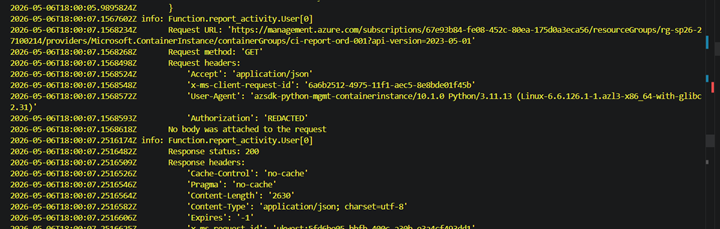

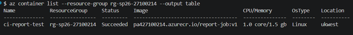
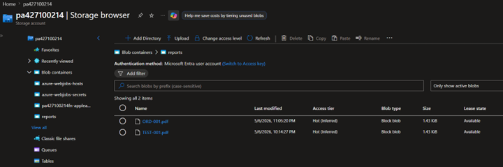
Description: The filtered log stream provides a formal trace of the order ID as it is successfully validated by the AKS microservice and reported via ACI.

### Evidence 7.4: Reject Path UI

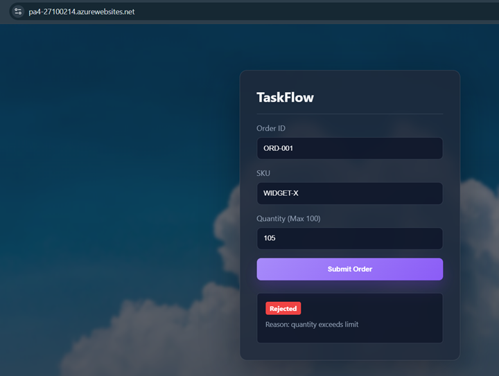

Description: The frontend correctly communicates the rejection status when the validation activity identifies a quantity exceeding 100 units.

### Evidence 7.5: Resource Group
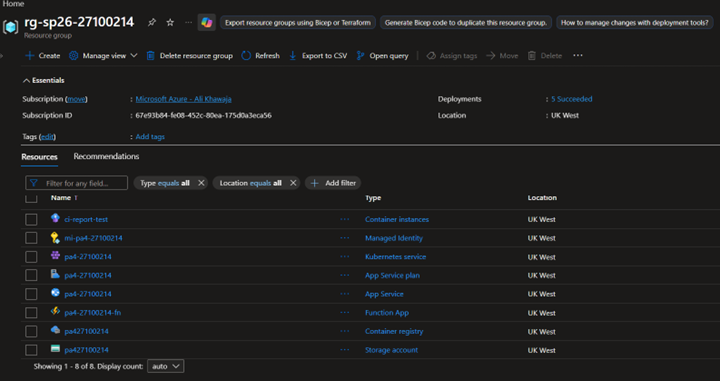
---

## Task 8: Write-up and Architecture Diagram (5 points)

### Evidence 8.1: Architecture Diagram

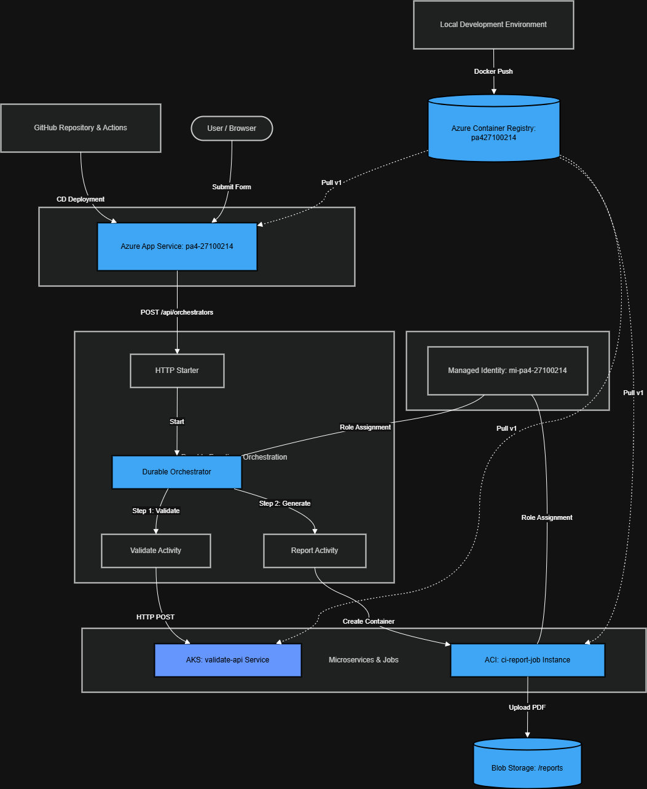

Description: The diagram illustrates the service interdependencies across App Service, Durable Functions, AKS, ACI, and Blob Storage.

### Question 8.2: Service Selection

- **App Service**: Chosen for the frontend to leverage managed platform features and seamless GitHub Actions integration.
- **Durable Functions**: Utilized to manage the complex, stateful orchestration required to chain separate cloud services.
- **AKS**: Selected to host the validator API as a dedicated, high-availability microservice.
- **ACI**: Optimal for the reporting job as a consumption-based, ephemeral container service that bills only during active execution.

### Question 8.3: ACI vs AKS

The AKS node pool incurs persistent costs to maintain availability for continuous validation requests. Conversely, ACI operates on a consumption-based model, incurring no idle costs and cleaning up resources automatically upon job completion.

### Question 8.4: Durable Functions vs Plain HTTP

Durable Functions provide robust state management and automated retries, preventing workflow disruptions during long-running tasks. They also eliminate the risk of client-side timeouts by enabling an asynchronous polling pattern.

### Question 8.5: Cost Review

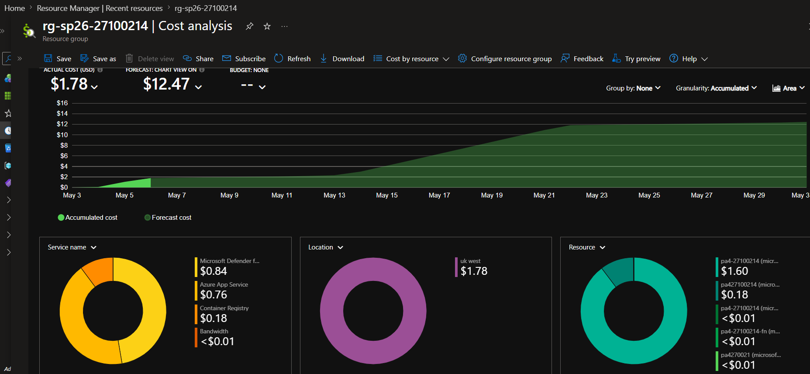

Description: As of May 6, 2026, the total actual consumption for this assignment is $1.78, with a projected monthly forecast of $12.47. Although the App Service Web App currently appears as the primary cost driver ($1.60) due to initial provisioning and security overhead, the AKS cluster is architecturally the most expensive resource in the pipeline. While its current cost appears negligible in this short-term snapshot, AKS relies on persistent Virtual Machine nodes that incur continuous hourly charges. In a sustained deployment, these fixed compute costs would significantly exceed the consumption-based billing models of the Function App and ACI instances.

### Question 8.6: Challenges Faced

A primary challenge involved subscription security policies blocking the default storage connection string for the Function App. I resolved this by implementing a Managed Identity (mi-pa4-27100214) and updating environment variables to authenticate via Client ID and Account Name. Additionally, the GitHub Actions pipeline failed initially due to configuration errors in the deployment YAML file. I successfully debugged the workflow logs and corrected the YAML file to restore the automated CI/CD path for the App Service.
---